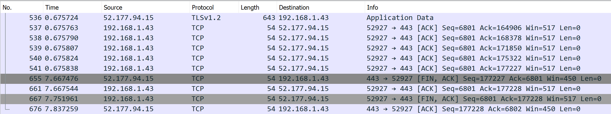
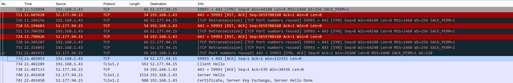
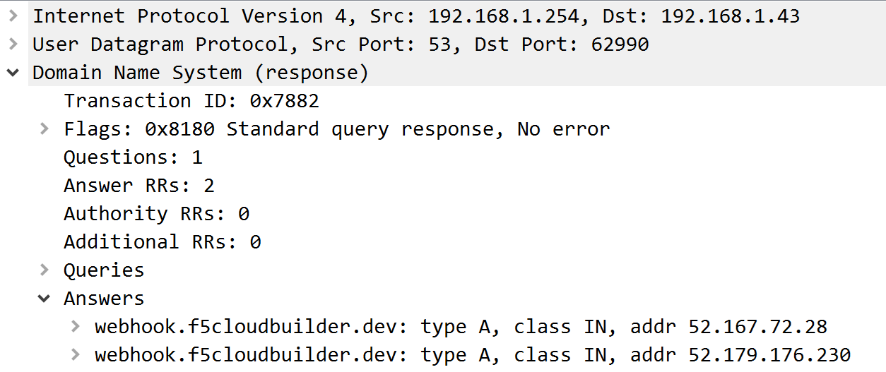
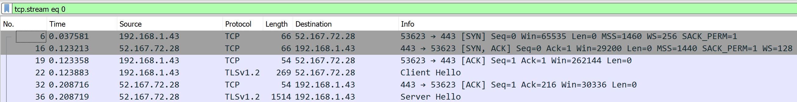
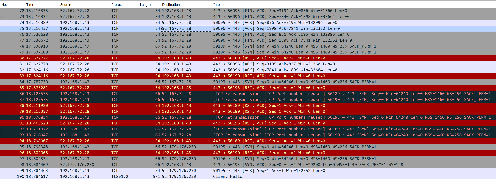
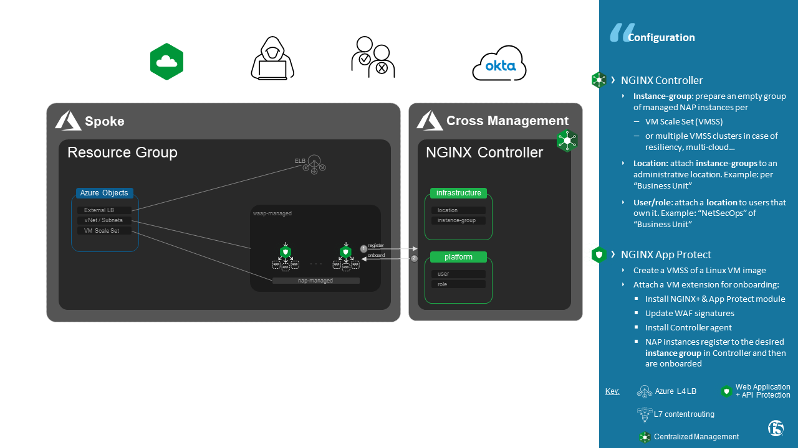

NGINX Controller makes Life Cycle Management simple
##############################################################

NGINX Controller offers a simplified **Life Cycle Management** of your NGINX instances across all of your environment:

- **Auto Scaling**
    during Scale In / Scale Out, the instance register / unregister to NGINX Controller
- **Up to date OS, software and Security signatures**
    use the native feature ``reimage`` or ``rolling upgrade`` of your Cloud Service Provider
- **Source Of Truth**
    a NGINX instance is bootstrapped from a standard Linux VM image, all of configurations are pushed from NGINX Controller
- **Cloud agnostic**
    same principles and onboarding scripts are reusable on any Cloud (Private, Public)
- **Native Scaling Policy**
    InfraOps are free to use the scaling policy offered by their Cloud Service Provider (CSP).

This repo provides a demo of a scaling group implementation using NGINX App Protect instances managed by NGINX Controller.

Last chapter warns you to take in consideration resiliency and DNS LB in order to enhance User Experience.

--------------------------------------------------------------------------------------------------------------------

.. contents:: Contents
    :local:

Demo video
*****************************************
Demo done on Azure using a VM Scale Set.

Scale Out
=========================================

.. raw:: html

    

Scale In
=========================================

.. raw:: html

    

Upgrade / Reimage
=========================================

.. raw:: html

    

Strategy - Mutable vs Immutable
*****************************************

When an new VM instance is bootstraped, this instance is up to date:

    - **OS** packages
    - **Software**: NGINX Plus, NGINX App Protect and NGINX Controller agent
    - **Security** signatures

Then this instance retrieve his configuration from NGINX Controller.
Therefore NGINX Controller is the *Source of Truth* for all of your managed NGINX instances.

In order to upgrade your cluster, the *immutable* approach is recommended: destroy & recreate your VM instances.
As done on **Kubernetes**, the *immutable* approach is more simpler and safer than the mutable approach that will apply changes.

How to do that on Azure VM Scale Set?

Immutable = Reimage
=========================================
If you select ``reimage``,
it will remove the VMSS instance and replace it with a brand new one.
This can be used if you are having issues or need to upgrade per instance, that will **delete it and redeploy it up to date**.

Mutable = Upgrade
=========================================
Upgrading will **apply any changes** that were applied to the scaleset as a whole.
So for example, if you apply a custom script extension to VMSS1 you need to update the VMSS instances in order for that custom script to actually be applied.

Architecture - Resiliency and DNS LB
********************************************************************************
During a *Scale In* or *reimage* operation,
an impact on User Experience exists if:

    - **persistency** is set on the downstream Load Balancer
    - **no Global Load Balancing** exists across regions or multi-cloud.

Symptom
=========================================
A user or a consumer have no access to the service during few seconds with no notification

Cause
=========================================
A Web Browser opens up to 15 TCP sessions to a remote Domain service
and keeps it them alive in order to re-use then to send further HTTP transactions.
When a ``Scale In`` or ``reimage`` operation occurs, NGINX process received a SIG_TERM signal and all of NGINX workers are shutdown gracefully: current HTTP transactions are drained and then TCP sessions are closed.

The picture below shows a ``reimage`` operation that occurs at second #7.

However, the External Azure Load Balancer is configured with:

    - a `Persistency <https://docs.microsoft.com/en-us/azure/load-balancer/distribution-mode-concepts>`_
    - a health probe interval of 5s
    - a unhealthy threshold of 2

In that case, further TCP sessions initiated from the browser will be stuck up to 15s to the same VM instance... that is unavailable.

After 15s, External Azure Load Balancer chose another pool member. Then the service is up again for this user.

*Source*: full PCAP capture with no DNS LB `here <https://github.com/nergalex/nap-azure-vmss/_files/Azure_LB_downtime.pcapng>`_

Solution
=========================================

Do not persist?
**No**, it's not a solution,
persistence is useful for :
    - Web Application Firewall security features that track user sessions (CSRF, DeviceID, JS injection, cookie...)
    - troubleshooting purpose

**DNS Load Balancing**

Use a DNS LB record to Load-Balance traffic across 2 regions or multi-cloud.
2 Public IPs are returned for your DNS domain.
If a TCP session on one Public IP returns a RST,
Web Browser will switch automatically to the other Public IP after 1s. Acceptable impact for a good User Experience, well done! :o)

DNS LB - Proof
=========================================
- `F5 Cloud Services DNS LB <https://www.f5.com/fr_fr/products/ways-to-deploy/cloud-services/dns-cloud-service>`_ hosts ``webhook.f5cloudbuilder.dev`` A record that returns 2 Public IPs:

    52.167.72.28 ; 52.179.176.230

- Web Browser resolves ``webhook.f5cloudbuilder.dev`` and keeps it in DNS Cache
    Because DNS Cache TTL in Chrome is 60s minimum (`here <https://source.chromium.org/chromium/chromium/src/+/master:net/dns/host_resolver_manager.cc;l=122?q=kCacheEntryTTLSeconds%20&ss=chromium%2Fchromium%2Fsrc&originalUrl=https:%2F%2Fcs.chromium.org%2F>`_), TTL of A record must be set at least to 60s

- Web Browser makes TCP connexions only to IP ``52.167.72.28``

- At second #13 in the picture bellow, NGINX VM is shutdown and NGINX closes all TCP connexions gracefully
- At second #17 Web Browser opens new TCP connexions to the same Public IP ``52.167.72.28`` and Azure Load Balancer responds with TCP RST due to persistence linked to a NGINX VM shutdown
- At second #18 Web Browser opens new TCP connexions to the second Public IP ``52.179.176.230``

*Source*: full PCAP capture with DNS LB `here <https://github.com/nergalex/nap-azure-vmss/_files/DNS_LB_TCP_failure_Chrome.pcapng>`_

Auto-Scaling implementation
*****************************************

Architecture
=========================================
- Components:
    - A NGINX Controller hosted in a "Cross Management" / "Shared service" / "Out of Band" zone
    - A VM Scale Set of NGINX App Protect instances
    - An External Azure Load Balancer to publish a Public IP

Once a VM is started, VM is onboarded using an Extension: Shell or Cloud Init commands that must includes to run the 2 scripts below. Example of Extension `here <https://github.com/nergalex/nap-azure-vmss/blob/master/_files/nginx_managed_by_controller_bootstrapping.jinja2>`_ in Jinja2 format for Ansible

Script 1 - Install packages
=========================================
`install_managed_nap.sh <https://github.com/nergalex/nap-azure-vmss/blob/master/install_managed_nap.sh>`_ install and run:

- NGINX+: Application Load-Balancer
- App Protect module: Web Application and API Protection
- last WAF signature update
- NGINX Controller agent: register VM instance and pull configuration

Input variables:

=====================================================  =======================================================================================================
Variable                                               Description
=====================================================  =======================================================================================================
``EXTRA_NGINX_CONTROLLER_IP``                          NGINX Controller IP
``EXTRA_NGINX_CONTROLLER_USERNAME``                    NGINX Controller user account
``EXTRA_NGINX_CONTROLLER_PASSWORD``                    NGINX Controller user password
``EXTRA_NGINX_PLUS_VERSION``                           NGINX+ version to install
``EXTRA_LOCATION``                                     Location name, same as created on NGINX Controller
``EXTRA_VMSS_NAME``                                    VM Scale Set name, same as the Instance Group created on NGINX Controller
=====================================================  =======================================================================================================

Script 2 - Monitor 'Scale In' event
=========================================
`scale_in_monitor.sh <https://github.com/nergalex/nap-azure-vmss/blob/master/scale_in_monitor.sh>`_ monitors a *Scale In* event.
When a Scale In occurs, this script is responsible to unregister this instance from NGINX Controller

Input variables:

=====================================================  =======================================================================================================
Variable                                               Description
=====================================================  =======================================================================================================
``ENV_CONTROLLER_USERNAME``                            NGINX Controller user account with less privilege on Instance Group
``ENV_CONTROLLER_PASSWORD``                            NGINX Controller user password
=====================================================  =======================================================================================================

